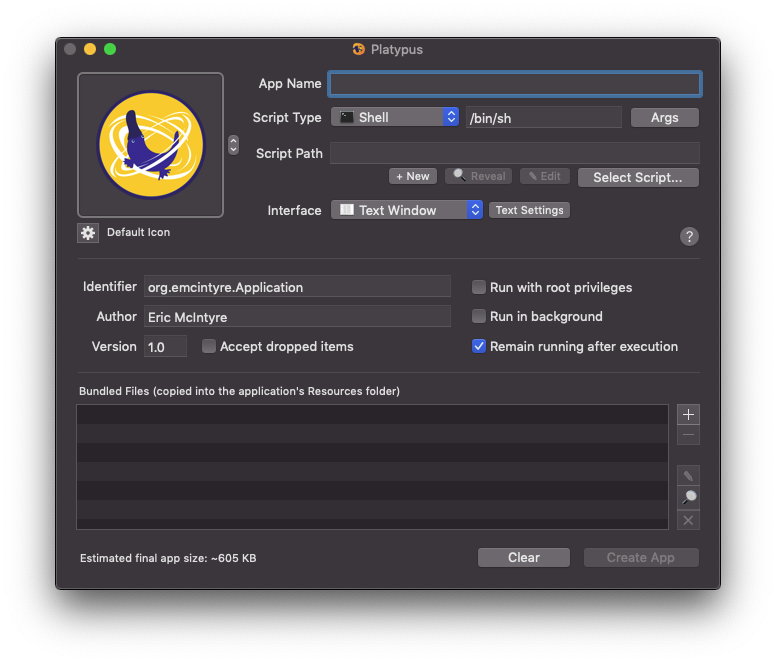
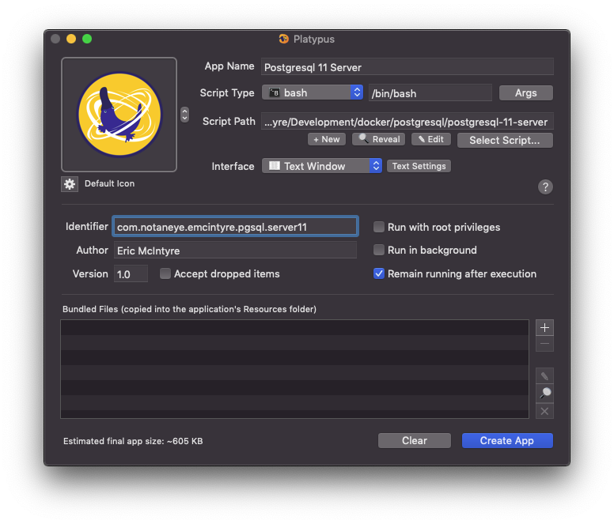
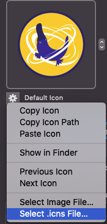

# Tool Containers

This repository contains scripts and other resources for using Docker containers to run various development tools.

## Getting Started

To begin, you'll obviously need to have a Docker runtime on your development machine. Follow the instructions for
[macOS](https://docs.docker.com/docker-for-mac/install/) or
[Windows](https://docs.docker.com/docker-for-windows/install/), as appropriate.

Once Docker is running on your machine, follow the specific instructions in the README of each tool directory.

## (macOS) Creating Applications

On macOS, you can use [Platypus](https://sveinbjorn.org/platypus) to create wrappers around the scripts that can be
launched from the Launchpad.

Download the installer from the link above, or install via Homebrew: `brew cask install platypus`

_macOS' security may prevent running Platypus the first time. You will need to allow it from "System Preferences >
Security & Privacy"_

After launching Platypus, you will see a dialog for configuring the application.

Fill in the configuration values for the application. The example below shows a "PostgreSQL 11 Server" configuration,
using the [script in this repository](postgresql.postgresql-11-server):

Start by setting the "App Name", then click "Select Script...". Navigate to the desired shell script. Set the
"Identifier" to something unique. You can also select an icon for the application, as shown:

Each supported tool in this repository contains an `.icns` file to use for that tool.
